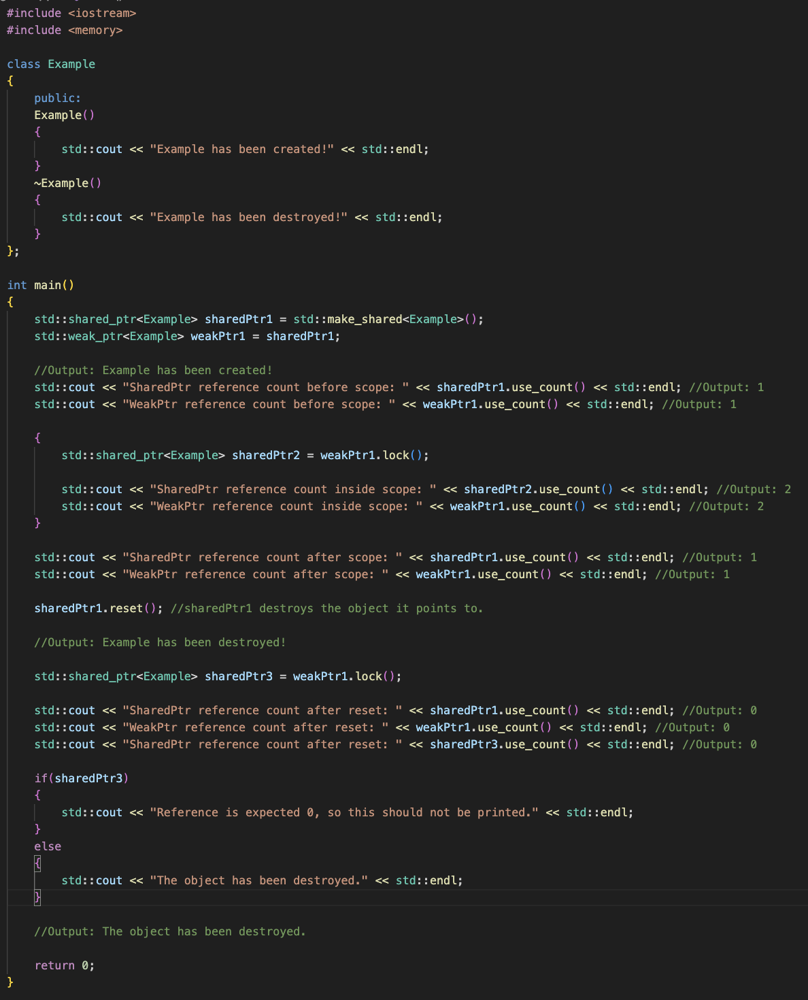
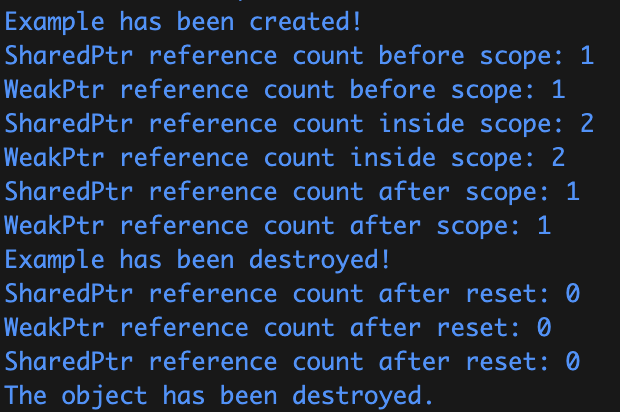
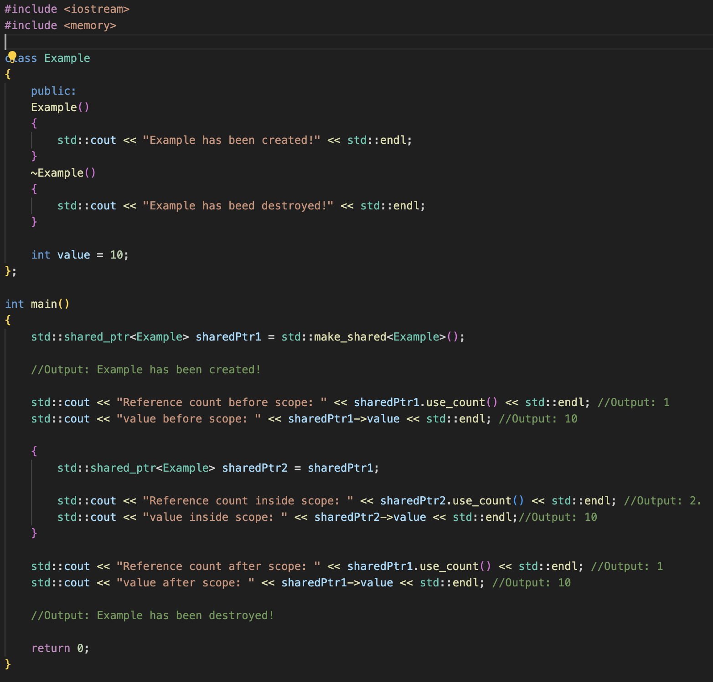
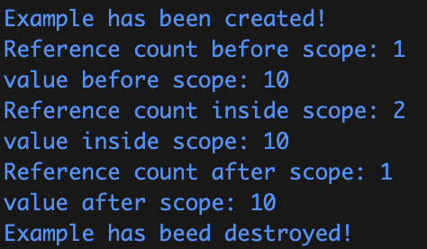

# Smart_Pointers_Cpp

C/C++ dillerinde pointerlar, değişkenlerin bellek adreslerini tutan değişkenlerdir. Pointerlar genellikle “Heap”te yeni nesneler oluşturmak, fonksiyonları, fonksiyonlara yollamak ve bir array(dizi) veya başka bir data structure(veri yapısı) içindeki elemanlar üzerinde gezmek için oluşturulur. Ancak pointerlar kullanılırken, bellek yönetimi manuel olarak yapılandırılır. Örneğin, “new” ile ayrılan bir pointer, kullanımı bittiğinde “delete” ile serbest bırakılmazsa, bellek sızıntısına sebep olabilir. Bu da diğer programların o bellek adresine erişip işlem yapamamasına veya zamanla belleğin tükenmesine yol açabilir.
C++11 ile tanıtılan smart “Smart Pointer” lar, bir nesnenin sahipliğini ve ömrünü yönetmek için kullanılan sınıflardır. “Smart Pointer”lar bellek sızıntılarının önlenmesini, bellek yönetiminin otomatik olarak sağlanmasını sağlarlar. “Smart Pointer” lar RAII (Resource Acquisition Is Initialization) idiomunun bir parçası olarak kullanılır. RAII kısaca, bir nesnenin ihtiyaç duyduğu kaynakları (örneğin dinamik bellek, dosya vs.) oluşturulduğu sırada (constructor’da) edinmesi, nesnenin yaşam döngüsü tamamlandığında (destructor çağırıldığında) ise edinilen kaynakların serbest bırakılmasıdır.
C++11 ve sonrası standartlarda gelen 3 ana “Smart Pointer” vardır: “unique_ptr”, “shared_ptr” ve “weak_ptr”. “Smart Pointer”lar, “<memory>” header dosyası altında, “std” namespace’inde tanımlıdırlar.
## unique_ptr
unique_ptr, yalnızca bir nesneye sahip olabilen bir “Smart Pointer”dır. Bu sahiplik aktarılabilir veya taşınabilir ancak kopyalanamaz veya paylaşılamaz. Sahiplikleri kopyalamak veya aktarmak için “move()” metodu kullanılabilir.
Örnek:

Burada, Example nesnesine işaret eden bir ptr1 ve ptr2 “unique_ptr”ları tanımlanmıştır. ptr1 işaretçisini, doğrudan ptr2 işaretçisine atanmaya kalkışılırsa, program hata verecektir. Çünkü, “unique_ptr”ların sahiplikleri kopyalanamaz veya paylaşılamaz. Ancak move() metodu ile bu sahiplik, ptr2 işaretçisine taşınabilir veya aktarılabilir. Bu işlemden sonra sahiplik, ptr2 işaretçisine geçmiştir ve ptr1 işaretçisi nullptr (0x0) olmuştur.
## shared_ptr
“shared_ptr”, bir nesnenin yaşam döngüsünün birden fazla işaretçi tarafından yönetildiği ve işaret edilen (yönetilen) nesnenin referans sayısını takip eden kontrol bloğuna sahip bir “Smart Pointer”dır. “unique_ptr”ların aksine, kopyalanabilir, başka bir “smart_ptr”a atanabilir ve fonksiyonlara parametre olarak aktarılabilir. Nesneye olan referans sayısı 0 a indiğinde, yani tüm “shared_ptr” nesneleri yok olduğunda, bu nesne de otomatik olarak silinir.

“shared_ptr”lar, işaret edilen nesnenin referans sayısını takip ederler. Örnekte, sharedPtr1 işaretçisi oluşturulduğunda, Example nesnesi için referans sayısı 1 olmuştur. Yeni bir scope oluşturulup, bu scope içinde sharedPtr2 adında yeni bir işaretçi oluşturulduğunda ve sharedPtr1 işaretçisi atandığında ise, Example nesnesi için referans sayısı 2'ye yükselecektir. sharedPtr2 işaretçisinin ömrü scope içinde sınırlıdır. Scope sonlandığında ise sharedPtr2 nesnesi yok olduğunda, Example nesnesi için referans değeri tekrar 1'e düşer. Program sonlandığında ise tüm işaretçiler yok edilir ve artık Example nesnesi için referans değeri 0'a düşer. Referans sayısı 0'a düştüğü için, Example nesnesinin destructor’u çalışır ve Example nesnesi de otomatik silinir.
## weak_ptr
“weak_ptr” lar, genellikle “shared_ptr”lar ile birlikte kullanılan, tıpkı “shared_ptr” lar gibi, başka bir “shared_ptr” tarafından sahip olunan kaynağa (nesneye) işaret edebilen, ancak nesneye sahip olamayan, yani nesnenin yaşam döngüsünü kontrol edemeyen bir “Smart Pointer”dır. Özetle, “weak_ptr”var, “shared_ptr”lar tarafından yönetilen nesnelere “zayıf” bir referans sağlarlar. “weak_ptr”lar genellikle, döngüsel referansları engellemek için kullanılır. Örneğin “A” ve “B” nesneleri olsun. A nesnesinin B nesnesine bir “shared_ptr”ı varsa ve aynı şekilde B nesnesinin A nesnesine bir “shared_ptr”ı varsa, A objesi de, B objesi de silinemez. Bu durum bir bellek sızıntısına yol açabilir.

Örnekte, Example nesnesini işaret eden, sharedPtr1 adında bir “shared_ptr” işaretçisi ve weakPtr1 adında bir “weak_ptr” işaretçisi oluşturulmuştur. sharedPtr1 işaretçisi, weakPtr1 işaretçisine (weakPtr1 tıpkı bir “shared_ptr”mış gibi) atanmıştır. Ancak dikkat edilirse, Example nesnesi için referans değeri 1 olarak kalmıştır. Bunun nedeni, “weak_ptr”ların işaret ettiği nesneye zayıf bir referans sağlaması ve işaret ettiği nesnelerin yaşam döngüsünde bir etkisi olmamasıdır. Örneğin devamında ise, yeni bir scope açılıp, açılan scope içinde yine Example nesnesine işaret eden sharedPtr2 adında başka bir işaretçi oluşturulmuştur. Ancak bu sefer, sharedPtr2 işaretçisine, weakPtr1 işaretçisi, lock() metodu ile atanmıştır. lock() metodu ile, weakPtr1 işaretçisinden bir “shared_ptr” oluşturulur. Bu da, Example nesnesi için referans sayısının artması, yani örneğe göre 2 olması anlamına gelmektedir. Scope bittiğinde ise referans sayısı tekrar 1'e düşer. reset() metodu ile, sharedPtr1 işaretçisinin işaret ettiği nesne serbest bırakılır ve eğer başka bir “shared_ptr” bu nesneye sahiplik etmiyorsa, nesnenin ömrü sona erer. Bu da Example destructor’unun çağırılmasına ve weakPtr1'in “shared_ptr”nesnesine olan referansın geçersiz hale gelmesine neden olacaktır. reset() işleminden sonra, Example için tekrar referans değerine bakıldığında, sayının 0 olduğu gözlemlenmektedir. Örneğin devamında, sharedPtr3 işaretçisi oluşturulmuştur ve tıpkı scope içindeki gibi weakPtr1 işaretçisi weakPtr1.lock() ile atanmıştır. Ancak sharedPtr1.reset() işleminden sonra sharedPtr1 işaretçisinin işaret ettiği nesne serbest bırakıldığından ve weakPtr1 işaretçisinin “shared_ptr”a olan referansının geçersiz olmasından dolayı, weakPtr1.lock(), nullptr değeri dönecektir. Bu yüzden program, örnekteki if bloğuna değil, else bloğuna girecektir.
